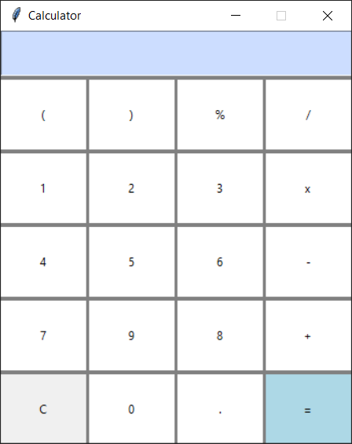

# Simple Calculator with Tkinter

This is a basic calculator application implemented in Python using the Tkinter library for the graphical user interface.

## Features
- Arithmetic operations: addition, subtraction, multiplication, and division.
- Parentheses support for complex expressions.
- Percentage calculation.
- Clear button to reset the input.
- Error handling for invalid expressions.

## Requirements
- Python 3.x
- Tkinter (usually included with Python installation)

## Usage
1. **Clone the repository:**
    ```bash
    git clone https://github.com/your-username/calculator-tkinter.git
    ```
2. **Navigate to the project directory:**
    ```bash
    cd calculator-tkinter
    ```
3. **Run the calculator:**
    ```bash
    python mein.py
    ```
4. **Use the calculator GUI to perform arithmetic calculations.**

## Screenshots


## Contributing
If you find any issues or have suggestions for improvement, feel free to open an issue or submit a pull request.

## License
This project is licensed under the MIT License.
